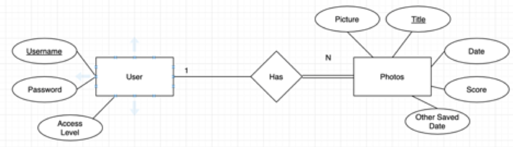

Deployment Environment
●	Our program is going to run on an aws server. http://ec2-18-220-231-153.us-east-2.compute.amazonaws.com/SoftwareDev/photoGrader.html
●	We plan on using a database on a server to save our data.
Functional Requirements
1.	DownloadPicsUseCase
○	Users can download already graded photos from the database.
2.	SearchGradedPhotos
○	Users can search a specific rating of graded photos (i.e. 7-10).
3.	UploadPicUseCase
○	Photographers can upload folder of photos to the database.

Database Design

ERD 

DDL

CREATE TABLE `Has` (
  `Title` varchar(60) NOT NULL,
  `Username` varchar(24) NOT NULL
) ENGINE=InnoDB DEFAULT CHARSET=latin1;
CREATE TABLE `Photos` (
  `Picture` varchar(70) NOT NULL,
  `Title` varchar(40) NOT NULL,
  `Date` timestamp(6) NOT NULL DEFAULT CURRENT_TIMESTAMP(6),
  `Score` float NOT NULL
) ENGINE=InnoDB DEFAULT CHARSET=latin1;
CREATE TABLE `User` (
  `Username` varchar(24) NOT NULL,
  `Password` varchar(24) NOT NULL,
  `Accesslevel` int(11) NOT NULL
) ENGINE=InnoDB DEFAULT CHARSET=latin1;
ALTER TABLE `Has`
  ADD PRIMARY KEY (`Username`,`Title`),
  ADD KEY `Title` (`Title`);
ALTER TABLE `Photos`
  ADD PRIMARY KEY (`Title`);
ALTER TABLE `User`
  ADD PRIMARY KEY (`Username`);
ALTER TABLE `Has`
  ADD CONSTRAINT `Has_ibfk_1` FOREIGN KEY (`Title`) REFERENCES `Photos` (`Title`) ON DELETE CASCADE ON UPDATE CASCADE,
  ADD CONSTRAINT `Has_ibfk_2` FOREIGN KEY (`Username`) REFERENCES `User` (`Username`) ON DELETE CASCADE ON UPDATE CASCADE;
COMMIT;

User Interface Files
1.	HTML file
2.	PHP file
Model Files (Database Access)
1.	SQL file
Controller Files (API or other)
1.	Image Quality Assessment (https://github.com/idealo/image-quality-assessment)
2.	Python file
Describe languages you need to use, and any gaps in skills on your team.
1.	Python
○	We will use Python to grade the photos.
2.	HTML/CSS/Javascript/PHP
○	We will use HTML/CSS/Javascript/PHP to make a login page and format our website. 
3.	SQL
○	We will use SQL to manage the photos in a database
     4. Skill gaps
○	No one is familiar with working with a photograder.
○	No one is familiar with working with photos with a database.

 Stubs.
1.	DownloadPicsUseCase
a.	DownloadPic(image){
	// downloads the images 
if(image)
		Image.download;
	Else {
	print(“Unable to download image);
}
}
2.	SearchGradedPhotos
a.	Search(image){
// searches the database for graded photos that have a better score // than 1
If (image.grade > 6){
		print(image);
		return
	}
}
3.	UploadPicUseCase
a.	Upload(image){
	// uploads the image to the database	
Image.upload;
return;
	}
